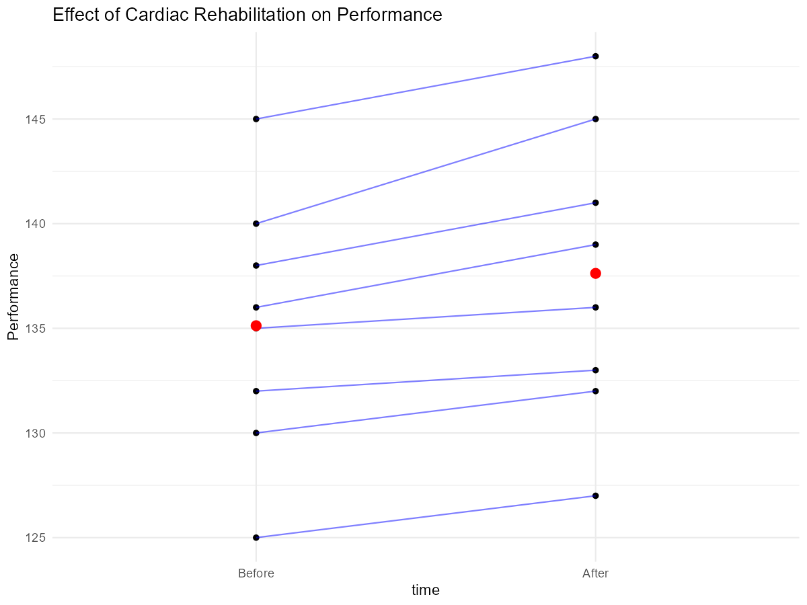
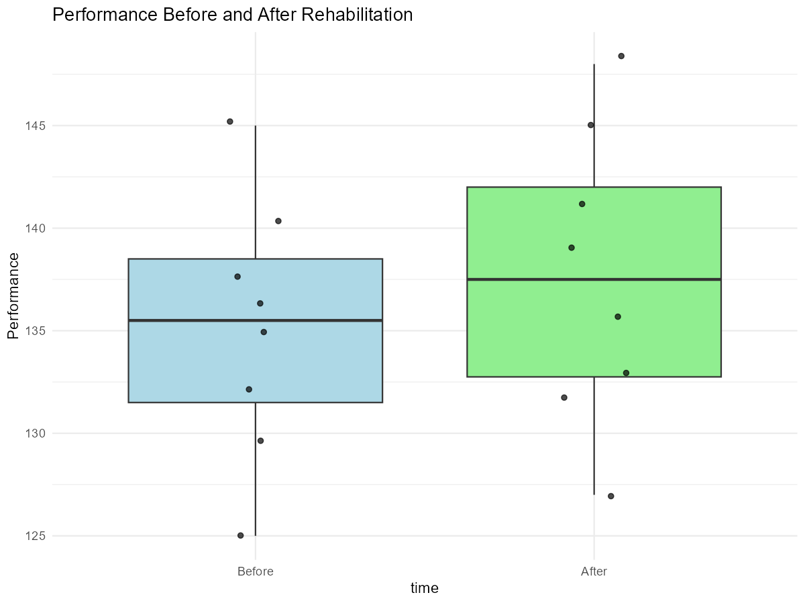
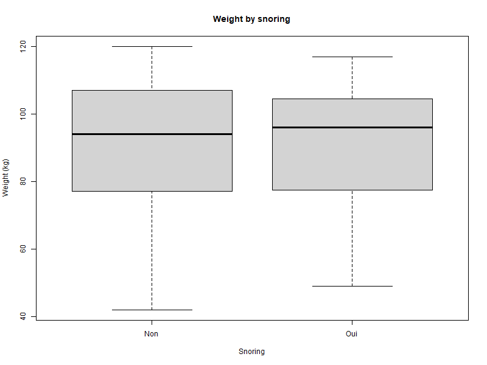
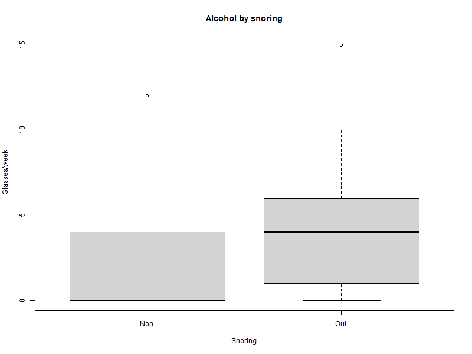
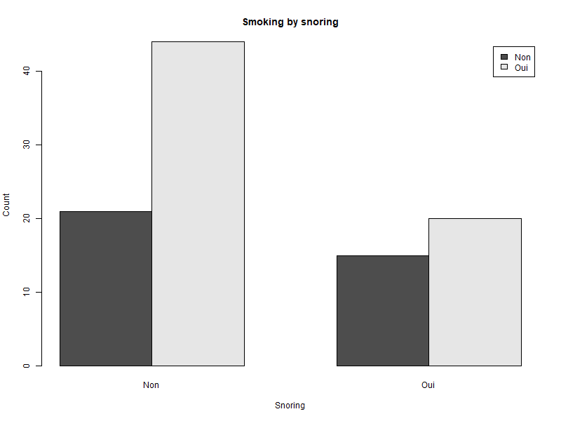
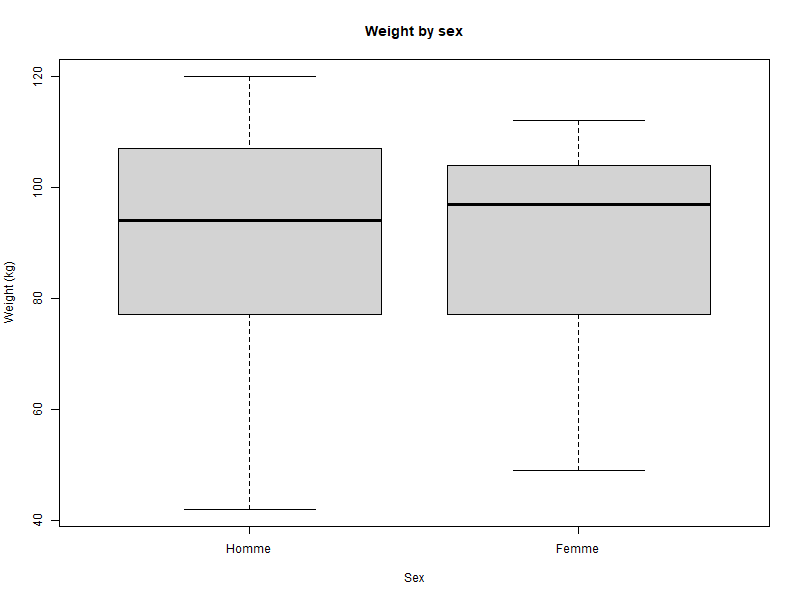
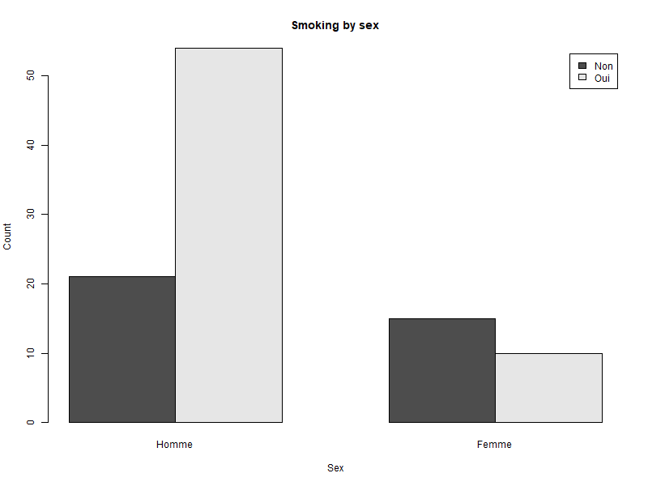
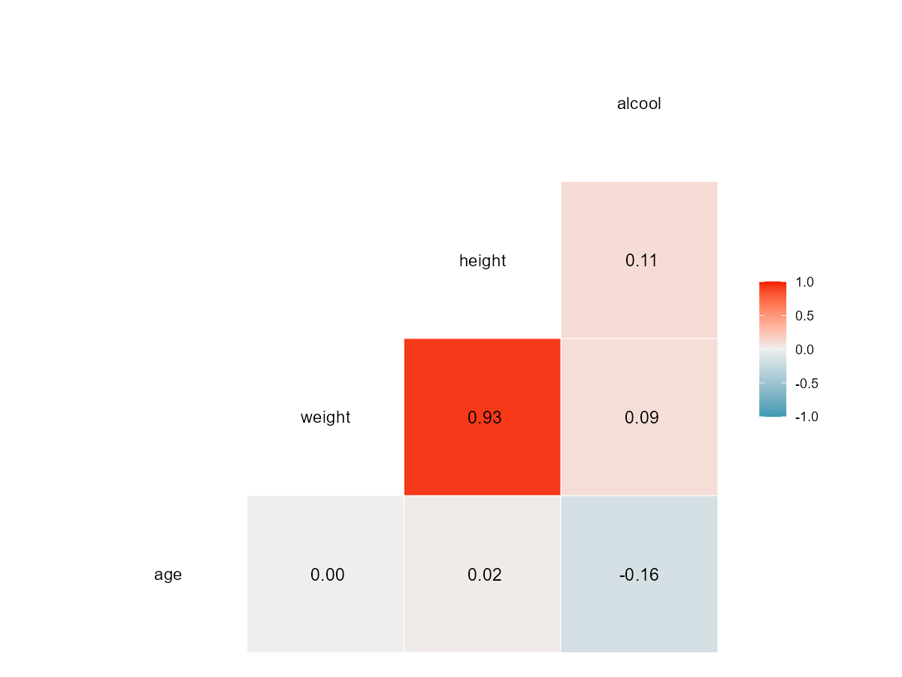

IEAP-2025 Series 02 RStudio Data mining and statistical tests 

## 1.1 The problem

There is a relationship between the nonuse of the proximal part of the upper limb (PANU) and the nonuse of the shoulder (SANU) or the elbow (EENU) ? 

## 1.2 The data

Data is far from perfect, but this is the reality of experimental data, especially in the case of clinical data 
==> Download the file NonUse.csv from the course Moodle.

```{r load-data echo=FALSE}
nonuse <- read.csv("data/test_data/NonUse.csv", sep=",", header=TRUE)
head(nonuse)
summary(nonuse)
```

| name | description                  | unit | range |
|------|------------------------------|------|-------|
| PANU | Proximal Arm Non Use         | \%   | 0-100 |
| SANU | Shoulder Antepulsion Non Use | \%   | 0-100 |
| EENU | Elbow Extension Non Use      | \%   | 0-100 |

### Description of the experiment, variables, and data characteristics  

**Description of the experiment**  
The dataset comes from a clinical experiment conducted with post-stroke patients. The aim is to study nonuse of the upper limb, by quantifying how much patients avoid using certain joints during reaching tasks. 

Three levels of nonuse were measured: 
proximal arm (PANU), 
shoulder antepulsion (SANU) 
and elbow extension (EENU) 
The central question is: is proximal nonuse (PANU) related to nonuse of the shoulder or the elbow?  

**Variables**  
All variables are continuous, expressed as percentages, and computed by comparing performances between two experimental conditions (free trunk vs blocked trunk).  
- PANU (Proximal Arm Non Use): nonuse of the proximal arm segment (upper arm).  
  Unit : % – Theoretical range: 0–100  
- SANU (Shoulder Antepulsion Non Use): nonuse of the shoulder joint in antepulsion.  
  Unit : % – Theoretical range: 0–100  
- EENU (Elbow Extension Non Use): nonuse of the elbow joint in extension.  
  Unit : % – Theoretical range: 0–100  

**Data characteristics**  
Each row corresponds to one participant (post-stroke).  
Columns display the measures for `PANU`, `SANU`, `EENU`.  
Values are real numbers, theoretically between 0 and 100.  
In practice, some results may be negative or greater than 100 due to experimental noise.  
The values for (`EENU`) and (`SANU`) are missing for patients 5 and 6.  


## 1.3 Corelation analysis

Since some values are missing, we use a Spearman correlation to observe whether patients with high PANU tend to have high SANU or EENU, without assuming a normal or linear distribution.

```{r}
cor.test(nonuse$PANU, nonuse$SANU, method="spearman")
```

Spearman correlation revealed a weak but significant positive association between PANU and SANU (ρ = 0.22, p = 0.002), indicating that patients with higher proximal arm nonuse tended to exhibit slightly higher shoulder nonuse.

```{r}
cor.test(nonuse$PANU, nonuse$EENU, method="spearman")
```
Spearman correlation revealed a moderate and highly significant positive association between PANU and EENU (ρ = 0.39, p < 0.001), indicating that patients with higher proximal arm nonuse tended to also exhibit higher elbow nonuse.

Visualize the PANU-SANU relationship and the PANU-EENU relationship

```{r plot sanu}
library(ggplot2)
ggplot(nonuse, aes(x=PANU, y=SANU)) +
  geom_point() +
  xlim(-100, 100) +
  ylim(-100, 100) +
  labs(title="PANU vs SANU", x="PANU (%)", y="SANU (%)") +
  theme_minimal()
```
Perform a linear regression for PANU-SANU (and for PANU-EENU) \*\* we do not predit a linear relationship between the variable, but we do it because it is asked...\*\*

```{r plot sanu}
library(ggplot2)
ggplot(nonuse, aes(x=PANU, y=EENU)) +
  geom_point() +
  geom_smooth(method="lm", se=FALSE, color="blue") +
  #xlim(-100, 100) +
  #ylim(-100, 100) +
  labs(title="PANU vs EENU", x="PANU (%)", y="EENU (%)") +
  theme_minimal()
```
Give the regression equations: PANU = a \* SANU + b and PANU = a \* EENU + b

```{r lm sanu}
lm_sanu <- lm(SANU ~ PANU, data=nonuse)
summary(lm_sanu)
coef(lm_sanu)
slope <- coef(lm_sanu)[2]
intercept <- coef(lm_sanu)[1]
cat("Regression equation: SANU =", slope, "* PANU +", intercept, "\n")
```

**Results summarize :**
Linear regression indicated a very weak positive relationship between proximal arm nonuse (PANU) and shoulder nonuse (SANU), but this association was not statistically significant (SANU = 0.089 * PANU + 0.586, p = 0.171, R² = 0.009). Spearman correlation, however, suggested a weak monotone trend (ρ = 0.22, p = 0.002), indicating that patients with higher PANU may slightly tend to have higher SANU.

**Limits :** 
- Linear regression assumptions: the relationship may be monotone rather than strictly linear, which reduces R².
- Weak association: slope is small, explaining very little variance.
- Missing data: 223 observations were removed, reducing power.
- Outliers: residuals range widely (-40 to 39), which can distort linear estimates.
- Correlation ≠ causation: cannot infer that PANU causes SANU.


### 2 Statistical tests: comparison of medians (or means?)

2.1 Make clear what is a statistical test, and when to use it. Below are some questions to guide your analysis. You can answer them in your notebook, with a short sentence for each question.

**Central tendency :**
Median : Central tendency of a distribution of ordinal variables. 50% of the observations are below it and 50% are above it. Intersting point : extreme values do not affect it.
Mean: Central tendency of a distribution of continuous variables. It is the sum of all values divided by the number of values. Intersting point : extreme values affect it.

**Dispersion mesure :**
Variance: Measure of the dispersion of a distribution. It is the mean of the squared differences between each value and the mean of the distribution. Useful to describe the dispersion of a distribution.
Standard deviation: Square root of the variance. It is expressed in the same unit as the variable. Useful to describe the dispersion of a distribution.
Normal distribution: distribution that follows a bell-shaped curve. It is characterized by its mean and standard deviation. Many statistical tests assume that the data follows a normal distribution.

**Statistical test :** all procedures for expressing parameters or studying their behavior in specific situations.
You can use it when you follow this rules : 
1- Hypotheses is clearly define – state null (H₀) and alternative (H₁) hypotheses.
2- You have check assumptions – verify parametric assumptions (normality, variance homogeneity) or use non-parametric tests if violated.
3- Choose the correct test – depending on data type, number of groups, paired/unpaired observations.
4- Decide significance level (α) – commonly 0.05.
5- Avoid multiple testing without correction – control false positives.
6- Interpret p-values correctly – p < α indicates evidence against H₀, not proof.
7- Report effect sizes and confidence intervals – not just p-values.
8- Consider sample size and power – small samples may give unreliable results

**Test :**
Parametric test : statistical test that assumes the data follow a specific distribution, usually normal, and relies on population parameters (mean, variance).
Assumptions of a parametric test:
1- Normality: The data (or residuals) are approximately normally distributed.
2- Independence: Observations are independent of each other.
3- Homogeneity of variance: Variances are equal across groups (for tests comparing groups).
4- Scale of measurement: Data are interval or ratio (continuous).
5- Random sampling: Data are collected through random sampling from the population.
6- Linearity (for correlations/regression): Relationship between variables is linear.

**A non-parametric test :** statistical test that does not assume a specific distribution for the data and is often used for ordinal data or when parametric assumptions are violated.
What are the assumptions of non-parametric tests : 
1- Independence: Observations are independent of each other.
2- Ordinal or continuous data: Data should be at least ordinal (ranked) or continuous.
3- Similar shape of distributions: For some tests (e.g., Mann-Whitney U), the distributions of the groups should have a similar shape.
4- Random sampling: Data should be collected through random sampling from the population.
5- Sufficient sample size: While non-parametric tests are less sensitive to small sample sizes, very small samples may still limit the test's power.


**P-value :** probability of obtaining test results at least as extreme as the observed results, assuming that the null hypothesis (H₀) is true. It quantifies the evidence against H₀; a smaller p-value indicates stronger evidence to reject H₀.
Risk of error when using a statistical test : the probability of making a wrong decision based on the test result. The two main types of errors are Type I error (false positive) and Type II error (false negative). The significance level (α) controls the risk of Type I error, while sample size and effect size influence the risk of Type II error.
Difference between a paired and an unpaired test : 
paired test : used when comparing two related or matched groups, such as measurements taken from the same subjects before and after an intervention. It accounts for the dependency between observations.
unpaired test : used when comparing two independent groups, where the observations in one group do not influence or relate to the observations in the other group.

*Source : Alain Varray Course, Statistics – Master 1 Common Core – UE3 E1*

## 2.2 Effect of treatment over time This is a very classical question in clinical or sport research: does a treatment-training have an effect over time?

We want to check if the rehabilitation training improved performance.
- compare each participant’s performance before vs. after the treatment.
- Variable: perf : HeartRate (HR)
- Groups: Before and After

Hypothesis : objective of the program was to improve participants’ performance and recovery after exercise. 

# 2.2.1 Download the file PrePost.csv

**Warning :** convert HR to a factor, because HR = integer but now it is read like a character so we can't compare like this the data. 
Clear : variable is quantitative (Heart Rate) and groups are qualitative (Before, After)

# 2.2.2 

Step 1: Load CSV  
Step 2: Convert 'HR' to factor  
Step 3: Add participant ID to handle duplicates  
Step 4: Pivot to wide format and check the array  
Step 5: Check normality of differences  
==> p-value = 0.2828 > 0.05 → normal distribution, ==> We used a paired t-test  
Step 6: Paired t-test  
A paired t-test was conducted to compare performance before and after the cardiac rehabilitation program. 
There was a significant increase in performance after the intervention, t(7) = -5.40, p = 0.001, 
with a mean difference of -2.5 (95% CI [-3.59, -1.41]). 
This indicates that the rehabilitation program had a positive effect on participant performance.  
Step 7: Visualization



  
**Conclusion :** A paired t-test was conducted to compare performance before and after the cardiac rehabilitation program. 
There was a significant increase in performance after the intervention, t(7) = -5.40, p = 0.001, with a mean difference of -2.5 (95% CI [-3.59, -1.41]). 
This indicates that the rehabilitation program had a positive effect on participant performance.


## 2.3 Testing some stereotypes Humans have stereotypes, some of them are probably true, some others are probably false (e.g., ref ).
# 2.3.1 Load Data snore.txt

# 2.3.2 The analysis
Warning: anthropometric and qualitative measurements

**Q1. Are snorers fatter?**
Test: Wilcoxon rank sum test   
Résultat: W = 1154, p = 0.908 → non significatif    
Graphique:   
Conclusion: There is no evidence that snorers are heavier than non-snorers. The data do not confirm this stereotype  

**Q2. Do snorers drink more?**  
Test: Wilcoxon rank sum test  
Résultat: W = 788, p = 0.0086 → significatif  
Graphique:   
Conclusion: Snorers tend to consume more alcohol per week than non-snorers. The data support this stereotype.  

**Q3. Do snorers smoke more?**  
Test: Pearson's Chi-squared test  
Résultat: X² = 0.689, p = 0.407 → non significatif  
Graphique:   
Conclusion: There is no evidence that snorers smoke more than non-snorers. The data do not confirm this stereotype  

**Q4. Are men fatter?**  
Test: Wilcoxon rank sum test  
Résultat: W = 981.5, p = 0.729 → non significatif  
Graphique:    
Conclusion: There is no evidence that men weigh more than women in this sample. The data do not support this stereotype.  

**Q5. Do women smoke less?**  
Test: Pearson's Chi-squared test  
Résultat: X² = 7.002, p = 0.0081 → significatif  
Graphique:   
Conclusion: Women smoke significantly less than men. The data confirm this stereotype.  

**Correlations between variables**
Array : 
Weight and height are highly correlated (0.93), which is expected.
Alcohol consumption shows very weak correlations with other numeric variables.
Age does not correlate meaningfully with weight, height, or alcohol.

**General conclusion :**
Some stereotypes are not supported (weight by snoring, weight by sex, smoking by snoring).
Others are supported (snorers drink more, women smoke less).
Numeric variables mostly show expected anthropometric correlations (weight ↔ height), but alcohol is largely independent.

# 3. Epilogue

Probably, in complex systems, we can make predictions based on the variability of data at a given time on the evolution of a system.
In addition, considering the strength of the relationships allows us to put into perspective which indicator to play on and why for the organization/disorganization of a system.
(e.g. sports team, organization of political bodies and declaration of law in France, cellular development, ....).

### Personnal conclusion : 

For this work, I used the LLM ChatGPT-5. I asked for help with:

- Factorizing categorical variables and converting numeric columns.
- Testing distributions: Shapiro-Wilk for normality, then choosing between t-test or Wilcoxon based on the result.
- Testing categorical variables: Chi-squared or Fisher’s exact test depending on the sample sizes.
- Writing code to display graphs: boxplots, barplots, paired line plots for PrePost, and a correlation matrix for numeric variables.
- How to display the generated graphs in the README.md.
- Support to ensure that the interpretations I made were based on the correct data (e.g., normality: p-values, and effect sizes).

After that, i asked : *What would have been the best prompts to ask you this easily, and what were my mistakes in the requests?*

The answer is :   
- Summary of best prompt practices  
- Separate questions or steps → allows for clear responses.  
- Specify the environment (notebook, README, GitHub).  
- Clarify the expected behavior or desired outcome.  
- Provide the data or a sample.  
- Specify the purpose.  

### References and Data sources
Data source :   
- NonUse.csv : https://github.com/DenisMot/RStudio-for-HMS-Template.git   
- PrePost.csv : https://github.com/DenisMot/RStudio-for-HMS-Template.git   
- snore.txt : https://github.com/DenisMot/RStudio-for-HMS-Template.git   
- Alain Varray Course, Statistics – Master 1 Common Core – UE3 E1   
- ChatGPT-5   
  
Time spend into this project : 6 hours.